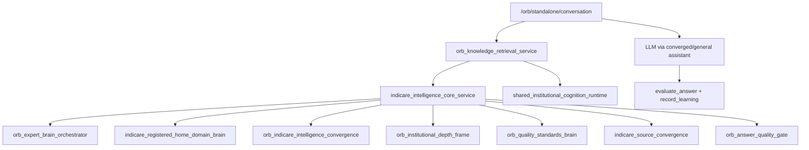

# IndiCare Intelligence Perfect 10 — Architecture

**ORB is the shell. IndiCare Intelligence is the brain.**

## Entry point

`services/indicare_intelligence_core_service.py` — `build_intelligence_packet()` is called for **every** `/ORB` request via `orb_knowledge_retrieval_service.prepare_request_bundle()`.

## Packet schema

```json
{
  "version": "indicare_intelligence_10",
  "orb_shell": true,
  "expert_depth": "general_light | residential_light | residential_standard | residential_deep | safeguarding_critical",
  "care_relevance_score": 0,
  "hidden_care_relevance_flags": [],
  "active_intelligence_layers": [],
  "active_brains": [],
  "registered_home_domains": [],
  "quality_standard_hits": [],
  "professional_lens_hits": [],
  "whole_child_domains": [],
  "scenario_sequences": [],
  "source_basis": {},
  "gaps": [],
  "missingness_graph": {},
  "quality_gate_preview": {},
  "learning_tags": [],
  "prompt_block": ""
}
```

## Adaptive depth rules

| Depth | When |
|-------|------|
| `general_light` | Low care relevance; non-care questions stay concise |
| `residential_light` | Care relevance ≥ 20–35; vague care prompts |
| `residential_standard` | Residential ORB modes; care score moderate |
| `residential_deep` | High care relevance or safeguarding mode |
| `safeguarding_critical` | Critical terms (weapon, suicide, allegation, LADO, etc.) |

High-risk answers must include: immediate safety, manager/on-call/local procedure, recording, plan update.

## Orchestration layers



## Convergence services (new)

| Service | Role |
|---------|------|
| `indicare_intelligence_core_service` | Single brain entry |
| `indicare_registered_home_domain_brain_service` | 55-domain map |
| `indicare_source_convergence_service` | Pack → trusted registry |

## Retained (not discarded)

- `orb_institutional_depth_frame_service` — depth frames for residential_light+
- `orb_residential_brain_catalog_service` — wording merged into domain map
- `orb_indicare_intelligence_convergence_service` — active layer language
