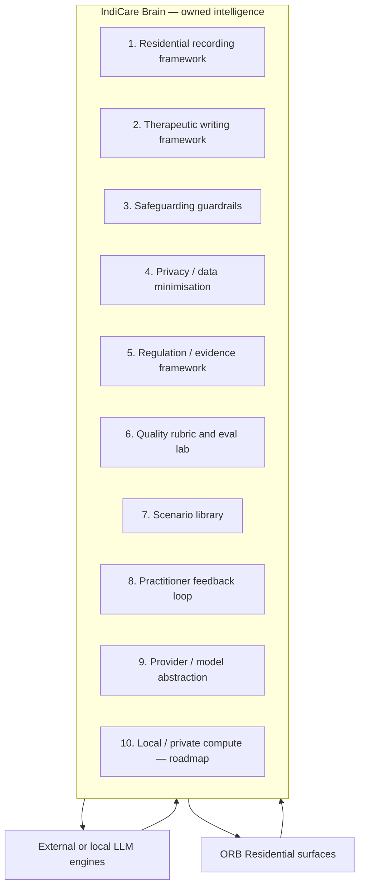

# IndiCare Internal Brain Architecture

**Status:** Internal technical baseline — June 2026  
**Audience:** IndiCare engineering, QA, and residential product leadership

## Purpose

IndiCare Intelligence is intended to become a **specialist residential childcare intelligence layer**, not a thin wrapper around an external large language model (LLM).

The product brain is owned by IndiCare:

- recording and therapeutic writing frameworks
- safeguarding and escalation guardrails
- privacy and data minimisation rules
- regulation and evidence framing
- quality rubrics and evaluation lab
- scenario libraries and regression harnesses
- practitioner feedback loops
- provider/model abstraction

The LLM is a **reasoning engine**, not the product brain.

> **Model-supported, not model-dependent**

## Design principles

1. **The child remains central** — outputs should foreground voice, presentation and welfare.
2. **Adults remain responsible** — ORB drafts, prompts and scores; it does not replace professional judgement, safeguarding decisions or inspection outcomes.
3. **No false compliance claims** — internal scores and readiness indicators are prompts for review, not guarantees.
4. **No invented facts** — missing information must be marked; rough inputs must not become fabricated detail.
5. **Safeguarding boundaries are non-negotiable** — escalation, DSL pathways and anti-investigation rules are enforced in frameworks and eval harnesses.

## Architecture layers

### 1. Residential childcare recording framework

- Source: `assistant/knowledge/orb_recording_framework.json`
- Service: `services/orb_recording_framework_service.py`
- Frontend mirror: `frontend-next/lib/orb/recording/`
- Record types, required sections, safeguarding checks, manager oversight checks

### 2. Therapeutic writing framework

- `assistant/knowledge/therapeutic_language.py`
- `frontend-next/lib/orb/recording/orb-therapeutic-writing.ts`
- Judgemental phrase maps, rewrite guidance, child-centred language rules

### 3. Safeguarding and escalation guardrails

- `assistant/safeguarding.py`, `assistant/safeguarding_escalation.py`
- `services/contextual_safeguarding_service.py`
- Red-team and adversarial packs in `scripts/run_orb_internal_brain_evaluation_packs.py`
- Quality lab critical failure detection in `services/orb_quality_lab_scoring_service.py`

### 4. Privacy and data minimisation framework

- `services/ai_redaction_service.py`, `services/ai_privacy_guard_service.py`
- ORB privacy routes and convergence tests
- Baseline scenarios use synthetic anonymised cases only

### 5. Regulation / evidence framework

- `assistant/knowledge/regulatory_framework.py`, `assistant/knowledge/reg44_reg45.py`
- Reg 40/44/45 record types in recording framework
- Evidence confidence engine — conservative, not grade-predictive

### 6. Quality rubric and eval lab

- **New baseline:** `assistant/evals/orb_residential_quality_rubric.py`
- **Runner:** `scripts/run_orb_residential_baseline.py`
- **Scenarios:** `quality/orb_residential_baseline_scenarios.json`
- **Reports:** `reports/orb_residential_baseline_report.{json,md}`
- Existing: ORB Quality Lab (`services/orb_quality_lab_service.py`), frontend launch fixtures (`frontend-next/lib/orb/evals/`)

### 7. Scenario library

- Baseline pack (15 residential scenarios) — synthetic only
- Expert scenario bank — `services/orb_expert_scenario_bank_service.py`
- Launch fixtures — `frontend-next/lib/orb/evals/orb-residential-launch-fixtures.ts`

### 8. Practitioner feedback loop

- Schema: `quality/orb_practitioner_feedback_schema.json`
- Existing ORB feedback routes/schemas — to converge with baseline lab over time

### 9. Provider / model abstraction

- Core registry: `services/ai_provider_registry.py`
- ORB assistant adapter: `assistant/services/model_provider_registry.py`
- LLM streaming: `assistant/llm_provider.py`
- Model router: `services/ai_model_router_service.py`
- Mock provider for CI/offline paths

### 10. Future local / private compute layer

**Roadmap — not current production reality**

- On-device or VPC-hosted models for sensitive drafting
- Private compute tier in provider registry (`AI_LOCAL_ENABLED`)
- E2EE AI processing is **not** currently implemented unless separately evidenced

Current generation still relies on configured external LLM providers for full conversational quality. Static and fixture eval modes do not require live LLM calls.

## What is already built vs partial

| Area | Status |
| --- | --- |
| Recording framework | Built |
| Therapeutic writing rules | Built |
| Safeguarding firewall / red-team | Built (partial coverage) |
| Quality Lab (founder) | Built |
| Frontend launch fixtures | Built |
| Residential baseline rubric + runner | **This pass** |
| Practitioner feedback schema | **Foundation this pass** |
| Provider registry enrichment | **Extended this pass** |
| Unified scenario convergence | Partial — multiple packs exist |
| Live LLM eval in CI | Intentionally disabled |
| Local/private compute | Roadmap |

## Safe reuse and convergence

**Safe to reuse**

- `orb_recording_framework.json` as single record-type source
- `orb_residential_quality_service.py` for heuristic checks
- Frontend `orb-residential-quality-assertions.ts` patterns (mirrored in Python rubric)
- `ai_provider_registry` — extend, do not fork

**Should converge**

- Expert scenario bank, launch fixtures and baseline scenarios → shared IDs and rubric where possible
- Quality Lab scoring (0–100) and baseline rubric (0–5) → document mapping, avoid duplicate divergent rules over time
- Practitioner feedback schema → ORB feedback API when ready

## Honest limitations

- Baseline scores are **internal** and not clinically or regulatorily validated.
- Fixture mode measures template/fixture behaviour, not live model performance.
- Live baseline mode uses framework scaffolds unless a full provider route is explicitly wired and enabled.
- Adults must review all ORB outputs before use in children's homes records.
