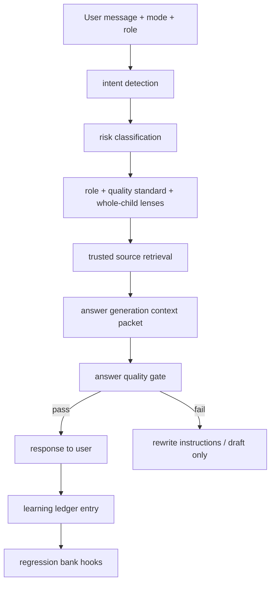

# ORB 9/10 Expert Brain — Master Architecture

> **ORB is the shell. IndiCare Intelligence is the brain.**

Every `/ORB` request passes through `services/indicare_intelligence_core_service.py` (Perfect 10), which orchestrates ORB 9 and converged layers. Answer depth adapts (`general_light` → `safeguarding_critical`) without forcing residential framing on unrelated questions.

See also: `docs/indicare-intelligence-perfect-10-architecture.md`

## Vision

One **Master ORB Expert Brain** that thinks around the **whole child** — not only Ofsted — with governed sources, explicit professional lenses, Quality Standards spine, missingness detection, and a safety quality gate before any answer is shown.

---

## A. Master ORB Expert Brain Orchestrator

**Service:** `services/orb_expert_brain_orchestrator_service.py`

| Stage | Responsibility | Existing adapter |
|-------|----------------|------------------|
| Intent detection | Residential vs general; scenario family | `orb_knowledge_retrieval_service`, `orb_expert_answer_engine_service` |
| Risk classification | low → critical | Expert engine classification |
| Role lens | RM, RSW, Reg 44, etc. | `orb_human_practice_brain_service` |
| Quality standard lens | QS1–QS9 | `orb_quality_standards_brain_service` |
| Source retrieval | Gold/silver/bronze/local only | `trusted_source_registry_service`, `orb_knowledge_retrieval_service` |
| Answer generation | Prompt blocks + expert packet | `orb_expert_answer_engine_service`, operating brain |
| Safety quality gate | 12-dimension score + thresholds | `orb_answer_quality_gate_service` |
| Citation / source basis | Trust tier + confidence | `orb_source_citation_service` |
| Learning ledger | Anonymised tags | `orb_learning_ledger_service` |
| Regression testing | 10 gold scenarios | `orb_regression_test_bank` |

---

## B. Core ORB answer sequence

Every **residential** answer packet must consider (when relevant):

1. Immediate safety  
2. Facts known (user-provided only in standalone)  
3. Missing information  
4. Child voice  
5. Professional curiosity  
6. Who to inform  
7. What to record  
8. What to escalate  
9. What to update (plans, risk, chronology)  
10. What evidence matters  
11. Manager oversight  
12. Multi-agency lens  
13. What ORB cannot decide  
14. Safe next step  

Encoded in: `assistant/knowledge/orb_operating_brain.py` (answer_standard), reinforced by orchestrator `response_sequence` block.

---

## C. Answer quality scoring

**Service:** `orb_answer_quality_gate_service.py`

| Dimension | Description |
|-----------|-------------|
| safe | No unsafe overclaim, escalation appropriate |
| specific | Scenario-specific, not generic waffle |
| residential | Children's homes context |
| child_centred | Voice, impact, rights |
| trauma_informed | Regulation, repair language |
| source_grounded | Trusted registry basis |
| recording_aware | What to record stated |
| manager_aware | Oversight where needed |
| multi_agency_aware | SW, police, health, LADO as relevant |
| evidence_aware | Impact not activity |
| ofsted_aware | SCCIF lens without grade prediction |
| missingness_aware | Gaps named |

**Minimum thresholds (0–100 composite):**

| Context | Minimum |
|---------|---------|
| High-risk safeguarding | 85 |
| Ofsted / Reg 44 / Reg 45 | 80 |
| Recording rewrite | 75 |
| General residential | 65 (must still pass `safe`) |

Failed gate → `rewrite_instructions` returned; weak answer marked `draft_internal` unless user explicitly requests draft mode.

---

## D. Brain update governance

| Rule | Enforcement |
|------|-------------|
| ORB may learn **patterns** automatically | Learning ledger tags, follow-up taxonomy |
| Must **not** auto-change safeguarding/regulatory/medical/legal guidance | `auto_apply_allowed: false` on gold statutory sources; `source_change_review_service` |
| Source changes create **pending review** | `source_update_watcher_service` |
| Ofsted report learning is **anonymised practice markers** | `ofsted_practice_pattern_service` |
| No child-identifiable sector intelligence | Ledger schema + service redaction |
| Versioned, auditable updates | Registry `last_checked`, SQL ledger, git-tracked JSON |

---

## Component map

| Component | Path |
|-----------|------|
| Orchestrator | `services/orb_expert_brain_orchestrator_service.py` |
| Trusted sources | `assistant/knowledge/trusted_sources_registry.json` |
| Quality Standards Brain | `services/orb_quality_standards_brain_service.py` |
| Whole Child Lens | `services/orb_whole_child_lens_service.py` |
| Scenario sequences | `assistant/knowledge/orb_scenario_sequences.json` |
| Gap detection | `services/orb_gap_detection_service.py` |
| Missingness graph | `services/orb_missingness_graph_service.py` |
| Learning ledger | `services/orb_learning_ledger_service.py` |
| Follow-up learning | `services/orb_followup_learning_service.py` |
| Ofsted report intelligence | `services/ofsted_report_*`, `orb_ofsted_learning_adapter.py` |
| Regression bank | `assistant/knowledge/orb_regression_test_bank.py` |

---

## Integration points

1. **`orb_knowledge_retrieval_service.prepare_request_bundle`** — merges `expert_brain_orchestrator.build_context_packet()` into bundle.  
2. **`orb_expert_answer_engine_service.build_expert_answer_packet`** — attaches `quality_standards`, `whole_child_lens`, `gaps`, `quality_gate_preview`.  
3. **`orb_general_assistant_service` / `orb_action_engine_service`** — run `quality_gate.evaluate_packet()` before returning text (when flag enabled).  
4. **Feedback routes** — append ledger row on feedback submit.

---

## Standalone vs OS

| Capability | Standalone ORB | IndiCare OS |
|------------|----------------|-------------|
| Live records | Never claimed | Chronology, incidents via scoped services |
| Source registry | Built-in + uploads | + provider policies, LSCP |
| Quality gate | Packet + text | Packet + text + record gaps |
| Learning ledger | Anonymised prompts | + home-scoped metadata (governed) |
