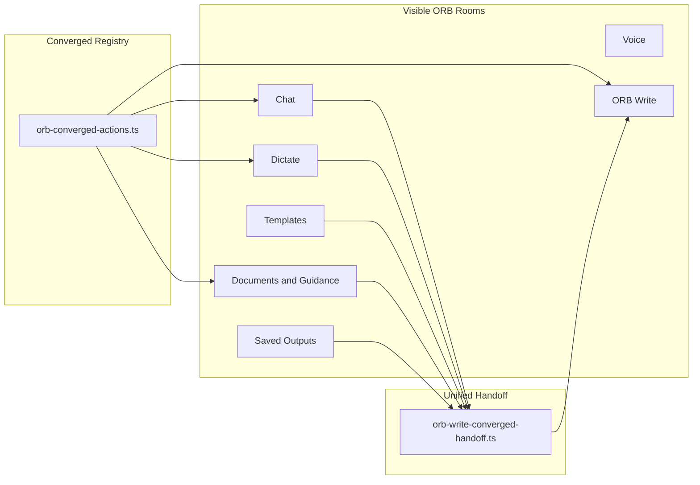

# ORB Existing Feature Convergence Map

## Product rooms

## Room → capability map

### Chat

| Capability | Source | Registry ID / route |
|---|---|---|
| Empty-state starters | `ORB_CONVERGED_CHAT_STARTER_ACTIONS` | `starter_*` |
| Safeguarding / Ofsted modes | `StandaloneOrbMode` on starters | API modes preserved |
| Message actions | `orb-assistant-message.tsx` | Existing action bar |
| Open in ORB Write | `convergedHandoffToOrbWrite` | `orb-write-converged-handoff.ts` |
| Intelligence support panel | `indicare-intelligence-core.ts` | No brain metadata exposed |

### Dictate

| Capability | Source | Registry ID / route |
|---|---|---|
| Hero output buttons | `ORB_CONVERGED_DICTATE_OUTPUTS` | `daily_record`, `incident_record`, … |
| Suggested outputs | Recording framework | `suggestedOutputsForRecordType` |
| Quick edit actions | `ORB_DICTATE_QUICK_ACTIONS` | Studio-only; modes in registry |
| ORB checks | Brain panel + recording framework checks | `analyzeOrbDictateSession` |
| Open in ORB Write | `saveOrbWriteHandoff` | Dictate session handoff |

### Voice

| Capability | Source | Notes |
|---|---|---|
| Realtime conversation | `lib/orb/voice/*` | Mostly unchanged |
| Save transcript | `save-voice-transcript.ts` | → Saved Outputs |
| Intelligence chips | `indicare-intelligence-core.ts` | Reused |

### ORB Write

| Capability | Source | Registry group |
|---|---|---|
| Core actions | `ORB_CONVERGED_WRITE_PANEL_GROUPS` → core | missing, review, grammar, … |
| Safety & quality | safety group | safeguarding, ofsted, recording, child voice, manager |
| Create related | create_related group | chronology, handover, manager summary, action plan, RI update |
| Export | export group | Prepare PDF (+ toolbar save/finalise) |
| Load handoffs | `orb-write-standalone-panel.tsx` | content, dictate, template |

### Templates

| Capability | Source | Notes |
|---|---|---|
| Recording library | `orb-recording-framework.ts` | Recommended types from convergence |
| Start in Dictate / Open in Write | `OrbRecordingLibraryCards.tsx` | Template + content handoffs |
| Reg 44 / handover templates | Framework record types | Linked to converged outputs |

### Documents & Guidance

| Capability | Source | Registry |
|---|---|---|
| First-class lenses | `RESIDENTIAL_FIRST_CLASS_LENSES` | `ORB_CONVERGED_DOCUMENT_LENSES` |
| Contextual actions | `contextualDocumentActions()` | Paste-detect |
| Cross actions | `use_write`, `use_template` | Handoff to Write / Templates |
| Knowledge library | Merged into document panel tabs | Official + home docs |

### Saved Outputs

| Capability | Source | Notes |
|---|---|---|
| List / filter / detail | `orb-saved-outputs-panel.tsx` | Source + type labels |
| Open in ORB Write | `handoffSavedOutputToOrbWrite` | **Newly wired in detail actions** |
| Re-run document lens | `resolveSavedOutputRerun` | → Documents |
| Empty state CTAs | Panel empty state | Chat, Dictate, Write, Documents |

## Convergence rules applied

1. **Chat** — quick starters from registry; conversational workflows via existing modes.
2. **Dictate** — hero outputs from registry; generation via existing routes.
3. **ORB Write** — main completion surface; panel groups from registry.
4. **Documents** — lenses from `document-intelligence.ts` with converged metadata.
5. **Templates** — structured record types from recording framework.
6. **Saved Outputs** — archive/reopen/export via existing adapters + converged Write handoff.
7. **Voice** — unchanged except existing save-to-library path.

## Deprecated surfaces (redirect only)

| Panel | Converged destination |
|---|---|
| Shift Builder | Templates + Chat |
| Review | ORB Write + Chat |
| Inspection Readiness | Documents + Chat |
| Safeguarding Thinking | Chat + Templates |
| Record This Properly | Dictate + Write + Templates |
| Knowledge Library | Documents & Guidance |
