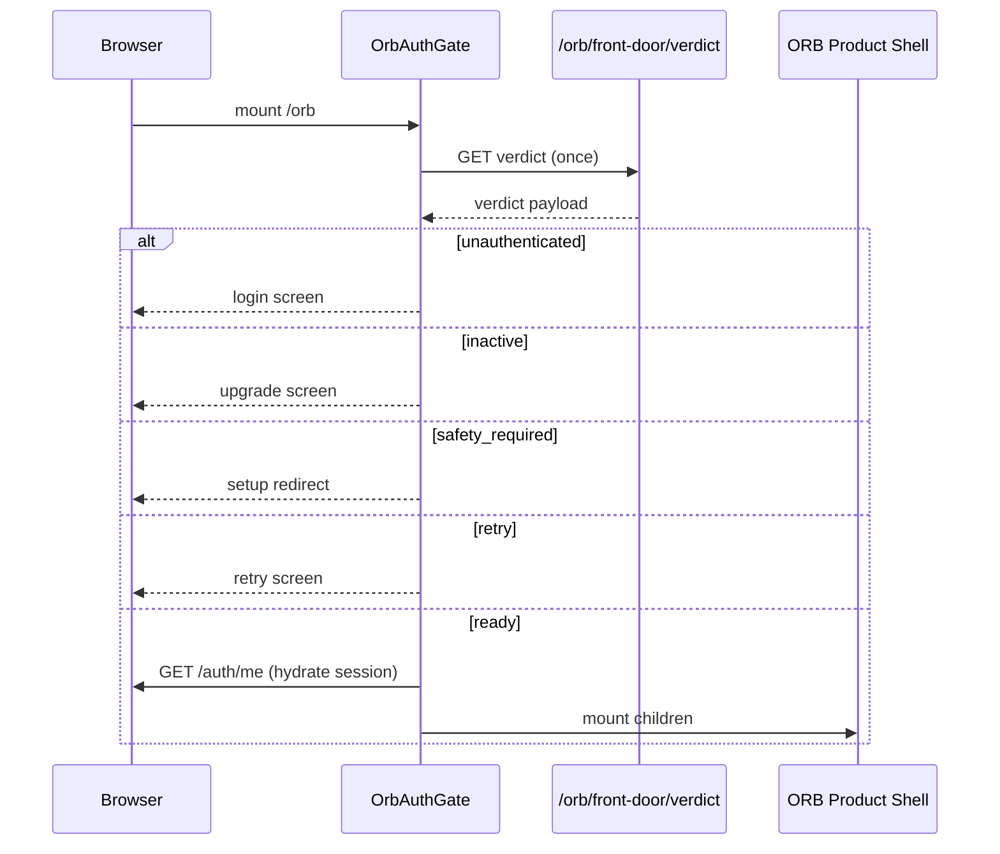

# ORB Front-Door Routing Contract

## Canonical front door

`/orb`

## Initial load sequence (post-fix)

## Navigation rules

- No automatic `router.replace('/orb')` during gate boot.
- Sign-out may navigate to `/orb` once.
- OAuth success may navigate once.
- User clicks may navigate.
- Background effects must not repeatedly navigate to the same `/orb` path.

## Legacy paths

Middleware converges `/login`, `/orb/login` → `/orb` with safe `returnUrl`.
