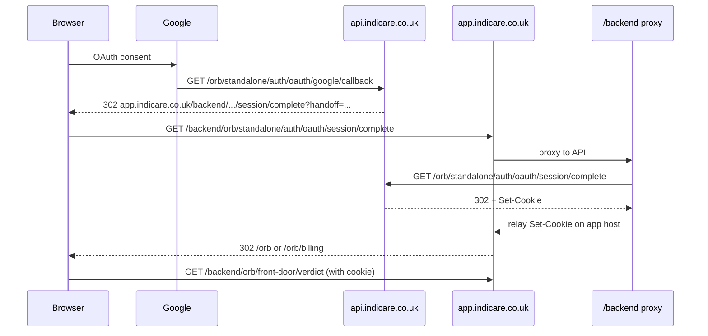

# ORB Google OAuth session-complete redirect debug

## Symptom

After Google OAuth callback on `api.indicare.co.uk`, production logs showed:

| Request | Status |
|---------|--------|
| `/orb/standalone/auth/oauth/google/callback` | 302 |
| `/orb/front-door/verdict` | 200 |
| `/mfa` | 200 |

No request appeared for:

- `/backend/orb/standalone/auth/oauth/session/complete` (app host proxy)
- `/orb/standalone/auth/oauth/session/complete` (API direct)

Users landed unauthenticated on the ORB front door or were incorrectly sent to MFA.

## Root cause

`FRONTEND_APP_URL` in Render was set to `https://indicare-frontend-next.onrender.com` while users browse on `https://app.indicare.co.uk`.

The OAuth callback built the session-complete redirect from `FRONTEND_APP_URL`, so the browser was sent to the Render hostname instead of the app host where the `/backend` proxy sets cookies:

```
https://indicare-frontend-next.onrender.com/backend/orb/standalone/auth/oauth/session/complete?handoff=...
```

Expected:

```
https://app.indicare.co.uk/backend/orb/standalone/auth/oauth/session/complete?handoff=...
```

Because the handoff never completed on `app.indicare.co.uk`, session cookies were not bound to the app host. Subsequent `/backend/orb/front-door/verdict` calls ran without a session.

## Fix

1. **`_orb_oauth_app_url()`** — OAuth session completion now prefers `APP_BASE_URL` (`app.indicare.co.uk`) or optional `ORB_OAUTH_APP_URL`, not the legacy Render preview URL in `FRONTEND_APP_URL`.
2. **`render.yaml`** — `FRONTEND_APP_URL` aligned to `https://app.indicare.co.uk`.
3. **Session-complete routing** — inactive ORB Residential users redirect to `/orb/billing`; active users to `/orb`; MFA only when `mfa_pending` is true (not for normal `orb_residential` OAuth).
4. **Safe diagnostics** — structured logs on callback and session-complete (no tokens, cookies, or secrets).

## Safe callback log fields

Emitted immediately before the callback `RedirectResponse`:

| Field | Example |
|-------|---------|
| `provider` | `google` |
| `oauth_callback_success` | `true` |
| `handoff_created` | `true` / `false` |
| `redirect_target_host` | `app.indicare.co.uk` |
| `redirect_target_path` | `/backend/orb/standalone/auth/oauth/session/complete` |
| `redirect_target_is_session_complete` | `true` / `false` |
| `mfa_required` | `true` / `false` |
| `access_state` | `active` / `inactive` / `unknown` |
| `response_status` | `302` |

Never logged: handoff token, OAuth code, access token, id token, cookies, secrets.

## Safe session-complete log fields

| Field | Example |
|-------|---------|
| `oauth_session_complete_hit` | `true` |
| `handoff_present` | `true` / `false` |
| `handoff_consumed` | `true` / `false` |
| `session_created` | `true` / `false` |
| `set_cookie_headers_present` | `true` / `false` |
| `redirect_target_path` | `/orb`, `/orb/billing`, `/mfa` |
| `mfa_required` | `true` / `false` |
| `access_state` | `active` / `inactive` / `unknown` |

## Expected post-fix flow



## Verification checklist

1. Callback log shows `redirect_target_host=app.indicare.co.uk` and `redirect_target_is_session_complete=true`.
2. App/proxy logs show `GET /backend/orb/standalone/auth/oauth/session/complete`.
3. Session-complete log shows `handoff_consumed=true`, `session_created=true`, `set_cookie_headers_present=true`.
4. Front-door verdict returns `authenticated=true` for the new session.
5. ORB Residential Google user: `mfa_required=false`; no `/mfa` redirect.

## Environment

| Variable | Production value |
|----------|------------------|
| `APP_BASE_URL` | `https://app.indicare.co.uk` |
| `FRONTEND_APP_URL` | `https://app.indicare.co.uk` |
| `ORB_OAUTH_APP_URL` | optional override; defaults to `APP_BASE_URL` |
| `OAUTH_GOOGLE_REDIRECT_URI` | `https://api.indicare.co.uk/orb/standalone/auth/oauth/google/callback` |

## Tests

```bash
python -m pytest tests/test_orb_oauth.py tests/test_orb_auth_production_readiness.py tests/test_orb_login_billing_routes.py -q

cd frontend-next
npm run typecheck
npm run build
NEXT_PUBLIC_E2E_TEST_MODE=1 npm run e2e:orb-auth
```

## Key files

- `routers/orb_oauth_routes.py` — callback redirect, session-complete, diagnostics
- `frontend-next/app/backend/[...path]/route.ts` — `/backend` proxy (forwards to API, relays `Set-Cookie`)
- `frontend-next/lib/auth/backend-proxy.ts` — proxy implementation
- `services/orb_oauth_session_handoff_service.py` — one-time handoff storage
- `render.yaml` — production env alignment
