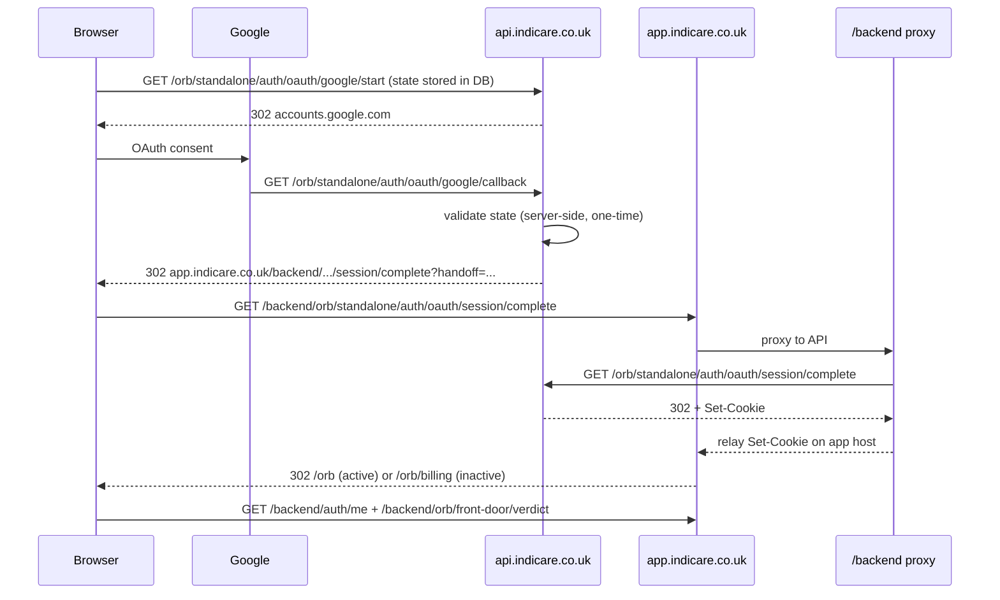

# ORB Google OAuth session-complete redirect debug

## Security check failed (app vs API host)

### Symptom

Google OAuth reached the provider and returned, but users were redirected to:

`/orb/login?oauth_error=Security%20check%20failed.%20Please%20try%20again.`

Production logs showed:

- `app.indicare.co.uk/orb/standalone/auth/oauth/google/start`
- `api.indicare.co.uk/orb/standalone/auth/oauth/google/callback`
- then `/orb/login?oauth_error=Security check failed`

### Root cause

OAuth CSRF `state` was stored in the Starlette server session (cookie-bound). OAuth **start** ran on the app host (`app.indicare.co.uk` via Next.js rewrite/proxy), while Google’s **callback** URI is registered on the API host (`api.indicare.co.uk`). The callback request could not read the app-host session cookie, so `validate_oauth_state` failed with “Security check failed”.

### Fix (June 2026)

1. **Server-side OAuth state** — `state` is stored in `orb_oauth_states` (Postgres), one-time use, short TTL. Callback on `api.indicare.co.uk` validates against DB, not app-host cookies.
2. **API-host OAuth start URLs** — login buttons navigate to `https://api.indicare.co.uk/orb/standalone/auth/oauth/{provider}/start?return_url=…` so start and callback share the API host when possible.
3. **Safe diagnostics** — structured logs on start and callback (`state_storage=server`, `state_valid`, `state_validation_failure_reason`) without logging raw state, codes, or tokens.

State validation remains enabled; the check is not disabled or weakened.

## Session-complete redirect (earlier issue)

### Symptom

After Google OAuth callback on `api.indicare.co.uk`, production logs showed:

| Request | Status |
|---------|--------|
| `/orb/standalone/auth/oauth/google/callback` | 302 |
| `/orb/front-door/verdict` | 200 |
| `/mfa` | 200 |

No request appeared for:

- `/backend/orb/standalone/auth/oauth/session/complete` (app host proxy)
- `/orb/standalone/auth/oauth/session/complete` (API direct)

Users landed unauthenticated on the ORB front door or were incorrectly sent to MFA.

### Root cause

`FRONTEND_APP_URL` in Render was set to `https://indicare-frontend-next.onrender.com` while users browse on `https://app.indicare.co.uk`.

The OAuth callback built the session-complete redirect from `FRONTEND_APP_URL`, so the browser was sent to the Render hostname instead of the app host where the `/backend` proxy sets cookies:

```
https://indicare-frontend-next.onrender.com/backend/orb/standalone/auth/oauth/session/complete?handoff=...
```

Expected:

```
https://app.indicare.co.uk/backend/orb/standalone/auth/oauth/session/complete?handoff=...
```

Because the handoff never completed on `app.indicare.co.uk`, session cookies were not bound to the app host. Subsequent `/backend/orb/front-door/verdict` calls ran without a session.

### Fix

1. **`_orb_oauth_app_url()`** — OAuth session completion now prefers `APP_BASE_URL` (`app.indicare.co.uk`) or optional `ORB_OAUTH_APP_URL`, not the legacy Render preview URL in `FRONTEND_APP_URL`.
2. **`render.yaml`** — `FRONTEND_APP_URL` aligned to `https://app.indicare.co.uk`.
3. **Session-complete routing** — inactive ORB Residential users redirect to `/orb/billing`; active users to `/orb`; MFA only when `mfa_pending` is true (not for normal `orb_residential` OAuth).
4. **Safe diagnostics** — structured logs on callback and session-complete (no tokens, cookies, or secrets).

## Safe OAuth start log fields

| Field | Example |
|-------|---------|
| `provider` | `google` |
| `oauth_start_host` | `api.indicare.co.uk` |
| `state_created` | `true` |
| `state_storage` | `server` |
| `redirect_uri_host` | `api.indicare.co.uk` |
| `start_redirect_host` | `accounts.google.com` |

## Safe callback state log fields

| Field | Example |
|-------|---------|
| `provider` | `google` |
| `callback_host` | `api.indicare.co.uk` |
| `state_present` | `true` / `false` |
| `state_valid` | `true` / `false` |
| `state_validation_failure_reason` | `missing_state`, `expired_state`, `consumed_state`, `unknown`, `none` |

## Safe callback redirect log fields

Emitted immediately before the callback `RedirectResponse`:

| Field | Example |
|-------|---------|
| `provider` | `google` |
| `oauth_callback_success` | `true` |
| `handoff_created` | `true` / `false` |
| `redirect_target_host` | `app.indicare.co.uk` |
| `redirect_target_path` | `/backend/orb/standalone/auth/oauth/session/complete` |
| `redirect_target_is_session_complete` | `true` / `false` |
| `mfa_required` | `true` / `false` |
| `access_state` | `active` / `inactive` / `unknown` |
| `response_status` | `302` |

Never logged: handoff token, OAuth code, access token, id token, cookies, secrets.

## Safe session-complete log fields

| Field | Example |
|-------|---------|
| `oauth_session_complete_hit` | `true` |
| `handoff_present` | `true` / `false` |
| `handoff_consumed` | `true` / `false` |
| `session_created` | `true` / `false` |
| `set_cookie_headers_present` | `true` / `false` |
| `redirect_target_path` | `/orb`, `/orb/billing`, `/mfa` |
| `mfa_required` | `true` / `false` |
| `access_state` | `active` / `inactive` / `unknown` |

## Expected production flow (post state + session-complete fix)



## Verification checklist

1. Callback log shows `redirect_target_host=app.indicare.co.uk` and `redirect_target_is_session_complete=true`.
2. App/proxy logs show `GET /backend/orb/standalone/auth/oauth/session/complete`.
3. Session-complete log shows `handoff_consumed=true`, `session_created=true`, `set_cookie_headers_present=true`.
4. Front-door verdict returns `authenticated=true` for the new session.
5. ORB Residential Google user: `mfa_required=false`; no `/mfa` redirect.

## Environment

| Variable | Production value |
|----------|------------------|
| `APP_BASE_URL` | `https://app.indicare.co.uk` |
| `FRONTEND_APP_URL` | `https://app.indicare.co.uk` |
| `ORB_OAUTH_APP_URL` | optional override; defaults to `APP_BASE_URL` |
| `OAUTH_GOOGLE_REDIRECT_URI` | `https://api.indicare.co.uk/orb/standalone/auth/oauth/google/callback` |

## Tests

```bash
python -m pytest tests/test_orb_oauth.py tests/test_orb_auth_production_readiness.py tests/test_orb_login_billing_routes.py -q

cd frontend-next
npm run typecheck
npm run build
NEXT_PUBLIC_E2E_TEST_MODE=1 npm run e2e:orb-auth
```

Verified in cloud agent run (June 2026): backend OAuth state tests, frontend typecheck/build, and ORB auth E2E including API-host start URLs and session-complete handoff mocks.

## Key files

- `services/orb_oauth_state_service.py` — server-side one-time OAuth state
- `sql/206_orb_oauth_states.sql` — state table migration
- `routers/orb_oauth_routes.py` — callback redirect, session-complete, diagnostics
- `frontend-next/lib/orb/orb-billing-client.ts` — `orbOAuthStartUrl()` API-host start URLs
- `frontend-next/app/backend/[...path]/route.ts` — `/backend` proxy (forwards to API, relays `Set-Cookie`)
- `frontend-next/lib/auth/backend-proxy.ts` — proxy implementation
- `services/orb_oauth_session_handoff_service.py` — one-time handoff storage
- `render.yaml` — production env alignment
