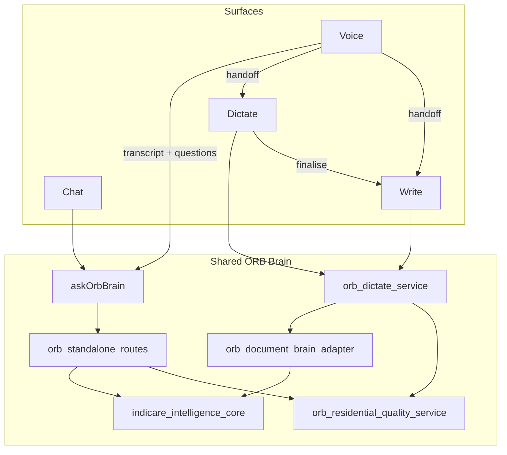

# ORB Residential Convergence Audit

**Date:** June 2026  
**Scope:** Voice, Dictate, Chat, ORB Write, Templates, Outputs, Memory/Context, Ofsted-readiness, Therapeutic recording  
**Principle:** One ORB brain → multiple surfaces → shared context → shared templates → shared quality layer

---

## Executive summary

ORB Residential already contains most building blocks for a unified assistant. **Chat and Voice are converged** on the shared frontend brain entrypoint (`askOrbBrain` → `/orb/standalone/conversation/stream`). **Dictate and Write share a document brain** (`/orb/dictate/*`) that partially uses the same intelligence core but does not route open-ended questions through the conversation pipeline.

This audit maps what exists, what is canonical, what is duplicated, and the recommended phased wiring — without breaking auth, billing, security, or existing UI shells.

---

## 1. What exists

### 1.1 Shared brain (canonical)

| Layer | File | Role |
|-------|------|------|
| Frontend entry | `frontend-next/lib/orb/orb-brain-router.ts` | `askOrbBrain`, `runOrbBrain`, `createOrbResponse`, `buildOrbBrainConversationRequest` |
| Frontend routing mirror | `frontend-next/lib/orb/orb-brain-router-intent.ts` | `routeOrbBrainIntent` — client telemetry/UI routing |
| Frontend transport | `frontend-next/lib/orb/standalone-client.ts` | SSE + POST to standalone conversation |
| Backend orchestration | `routers/orb_standalone_routes.py` | `standalone_orb_conversation`, `standalone_orb_conversation_stream` |
| Intelligence packet | `services/indicare_intelligence_core_service.py` | `build_intelligence_packet` — always-on pre-LLM packet |
| Brain framing | `services/orb_standalone_brain_service.py` | `frame` — general vs residential vs live_lookup |
| Query classification | `services/orb_knowledge_retrieval_service.py` | `classify_query`, `resolve_prompt_tier` |
| Post-answer finalize | `services/indicare_intelligence_route_finalize_service.py` | `finalize_standalone_intelligence` |
| Default LLM runtime | `services/orb_converged_general_assistant_service.py` | General assistant default when `ORB_USE_CONVERGED_RUNTIME=true` |
| Brain metadata | `services/orb_brain_metadata_service.py` | Contract for `brain_metadata` on all surfaces |
| Document brain adapter | `services/orb_document_brain_adapter_service.py` | **New** — unifies Dictate/Write brain metadata path |
| Shared quality layer | `services/orb_residential_quality_service.py` | **New** — child-centred, Ofsted-ready checks for all surfaces |

### 1.2 Voice

| File | Role |
|------|------|
| `frontend-next/lib/orb/voice/orb-voice-transcript.ts` | Final chunk assembly |
| `frontend-next/lib/orb/voice/save-voice-transcript.ts` | Save to Saved Outputs; `formatVoiceTurnsPlainText` |
| `frontend-next/lib/orb/voice/orb-realtime-voice-client.ts` | OpenAI Realtime with `brainRouted: true` (transcription-only) |
| `frontend-next/components/orb-standalone/orb-voice-station.tsx` | Main voice UI — two-sided transcript, handoffs |
| `frontend-next/components/orb-standalone/orb-voice-transcript-actions.tsx` | Copy, Save, Send to Dictate, Send to Chat |
| `routers/orb_voice_residential_routes.py` | Session/WebRTC transport only — not cognition |
| `services/orb_voice_session_service.py` | **OS operational voice** — separate from Residential |
| `services/orb_conversation_policy.py` | Spoken shaping for **operational** voice only |

**Voice flow (converged):** User speech → Realtime STT → `onSendToOrb` → `askOrbBrain({ source: 'voice' })` → chat brain → reply shown as `assistantReply` + synced into `VoiceTurn[]`.

### 1.3 Dictate

| File | Role |
|------|------|
| `schemas/orb_dictate.py` | Request/response contracts |
| `routers/orb_dictate_routes.py` | `/orb/dictate/*` — analyze, generate, edit, finalise |
| `services/orb_dictate_service.py` | Generation, analysis, finalise |
| `services/orb_dictate_edit_service.py` | Write AI actions (therapeutic, Ofsted-ready, etc.) |
| `services/orb_dictate_quality.py` | Heuristic quality checks (used via shared layer) |
| `services/orb_dictate_template_registry.py` | 17 note-type templates with section prompts |
| `services/recording_intelligence_service.py` | Missing-info and child-voice prompt blocks |
| `frontend-next/lib/orb/dictate/orb-dictate-client.ts` | API client |
| `frontend-next/components/orb-standalone/orb-dictate-station.tsx` | Capture → studio → embedded Write |

### 1.4 ORB Write

| File | Role |
|------|------|
| `frontend-next/components/orb-write/orb-write-standalone-panel.tsx` | Full document studio |
| `frontend-next/components/orb-write/orb-write-editor.tsx` | Rich editor |
| `frontend-next/lib/orb/write/orb-write-converged-handoff.ts` | Unified handoff from Voice/Dictate/Chat/Templates |
| `routers/document_engine_routes.py` | **IndiCare OS document system** — not ORB Write |

Write uses Dictate APIs (`analyze`, `generate`, `edit`, `save`, `export`) — no separate generation path.

### 1.5 Chat

| File | Role |
|------|------|
| `frontend-next/components/orb-standalone/orb-care-companion.tsx` | Main chat + panel orchestration; `sendMessage` → `askOrbBrain` |
| `frontend-next/components/orb-standalone/orb-minimal-chat.tsx` | Lightweight chat — now routes via `askOrbBrain` |
| `tests/test_orb_standalone_streaming.py` | Stream contract |

### 1.6 Templates & outputs

| Registry | File |
|----------|------|
| Dictate templates | `services/orb_dictate_template_registry.py` |
| Recording framework (canonical structure) | `assistant/knowledge/orb_recording_framework.json` |
| Template library (chat/docs) | `services/orb_template_library_registry.py` |
| Therapeutic writing overlay | `frontend-next/lib/orb/recording/orb-therapeutic-writing.ts` |
| Saved outputs | `services/orb_saved_output_service.py` |

### 1.7 Memory / context

| Tier | File | Safe for standalone? |
|------|------|------------------------|
| User preferences (whitelist) | `assistant/user_memory_policy.py` | Yes |
| ORB prefs | `services/orb_memory_service.py` | Yes |
| Presence/UI continuity | `services/orb_presence_memory_service.py` | Yes — blocks child IDs in standalone |
| Session chat history | `assistant/memory.py` | Yes — conversation scoped |
| Operational projection | `services/orb_operational_memory_service.py` | OS only |
| Child-specific | Governed by OS permissions | **No** in standalone |

### 1.8 Ofsted / Reg44 / Reg45 / safeguarding

- Standalone modes in `orb_standalone_routes.py` and slash commands in `orb-care-companion.tsx`
- `services/orb_answer_quality_gate_service.py` — 12-dimension gate with Ofsted/Reg44 thresholds
- `services/inspection_readiness_service.py` — Reg 44/45 evidence packs (metadata only)
- `services/reg45_quality_review_service.py` — Reg 45 review builder
- Dictate templates: `reg44_prep_note`, `ofsted_evidence_summary`, `safeguarding_concern_record`, etc.

### 1.9 Live / current / local

- `routeOrbBrainIntent` → `live_lookup` route for weather/news/sports/local
- `orb_knowledge_retrieval_service.LIVE_LOOKUP_NOTE` — honest "not connected" when tools unavailable
- `orb_standalone_brain_service.frame` — forbids inventing live facts

---

## 2. What is canonical

| Concern | Canonical |
|---------|-----------|
| Conversational brain | `askOrbBrain` → `orb_standalone_routes` conversation stream |
| Document/recording brain | `/orb/dictate/*` via `orb_dictate_service` + `orb_document_brain_adapter_service` |
| Recording structure | `orb_recording_framework.json` |
| Dictate note sections | `orb_dictate_template_registry.py` |
| Quality heuristics | `orb_residential_quality_service.py` (wraps `orb_dictate_quality.py`) |
| Brain metadata contract | `orb_brain_metadata_service.build_brain_metadata` |
| Intelligence packet | `indicare_intelligence_core_service.build_intelligence_packet` |
| Voice transport | `orb_voice_residential_routes.py` + `brainRouted: true` realtime |
| Write handoffs | `orb-write-converged-handoff.ts` |

---

## 3. What is duplicated

| Duplication | Locations | Risk |
|-------------|-----------|------|
| Routing classification | FE `routeOrbBrainIntent`, BE `classify_query`, BE `frame` | Drift on keyword lists |
| Template sources | dictate registry, recording framework, template library, studio TS | Partial overlap — framework is convergence target |
| Quality checks | `orb_dictate_quality.py`, `recording-quality-coach.ts` | Aligned but not one shared package |
| Voice architectures | Residential (`/orb/voice/*`) vs OS (`/orb/session/*`) | Intentional product boundary |
| Chat entry bypasses | `orb-minimal-chat` (fixed), `app/orb/ask/page.tsx` | Minor — minimal-chat now uses `askOrbBrain` |
| Premium alternate route | `POST /orb/residential/conversation` | Lighter orchestration than standalone |

---

## 4. What is legacy (keep, do not delete)

| File | Status |
|------|--------|
| `routers/orb_routes.py` (`/api/orb/conversation`) | Legacy operational — wrap later |
| `routers/assistant_routes.py` | Legacy assistant orchestrator |
| `services/orb_voice_session_service.py` | OS voice — production for embedded assistant |
| `frontend/js/indicare-voice-companion.js` | Legacy vanilla frontend |
| `frontend-next/components/orb-standalone/orb-voice-mobile-experience.tsx` | Deprecated — kept for contract tests |
| `routers/document_engine_routes.py` | IndiCare OS — separate product |

---

## 5. What is half-built

| Item | Gap |
|------|-----|
| Template → Write auto-fill | Partial; handoff works, full section fill is follow-up |
| Live lookup tools | Routing exists; provider integrations are extension points |
| Brain selection shadow → live | `orb_brain_selection_shadow_service` measures only |
| Safeguarding reminders in settings | UI shows "coming soon" |
| Shared quality-coach npm package | Backend mirror exists; no shared TS/Python module yet |
| Experience bundle adoption | Routes exist; some frontend still uses demo adapters |

---

## 6. Files to stay untouched

- Auth: `auth/*`, login flows, MFA
- Billing: `services/orb_plan_enforcement_service.py`, subscription checks
- Security: `services/ai_external_call_governance.py`, CSRF, session middleware
- Microphone/session permission logic in voice components
- Voice/Dictate/Chat/Write **visual shells** and layout
- Export/print/save behaviour in Write and Dictate
- `routers/document_engine_routes.py` (OS documents)
- Database schema and migrations

---

## 7. Files wired together (this pass)

| From | To | Mechanism |
|------|-----|-----------|
| Voice transcript | Dictate | `onOpenDictate(transcript, noteType)` |
| Voice transcript | Write | `convergedHandoffToOrbWrite` via `onOpenWrite` |
| Voice transcript | Chat | `onSendToOrb` → `askOrbBrain` |
| Voice assistant reply | Transcript turns | `useEffect` sync on `assistantReplyKey` |
| Dictate | Write | `POST /orb/dictate/finalise` → sessionStorage handoff |
| Dictate/Write | Quality layer | `orb_residential_quality_service` |
| Dictate/Write | Brain metadata | `orb_document_brain_adapter_service` |
| Chat | Write | `openOrbWriteWithContent` |
| Templates | Dictate/Write | `convergedTemplateHandoff` |

---

## 8. Missing pieces — small safe additions (done or planned)

| Addition | File | Status |
|----------|------|--------|
| Shared quality service | `services/orb_residential_quality_service.py` | **Added** |
| Quality API endpoint | `POST /orb/standalone/quality-check` | **Added** |
| Document brain adapter | `services/orb_document_brain_adapter_service.py` | **Added** |
| Frontend quality client | `frontend-next/lib/orb/residential/orb-residential-quality.ts` | **Added** |
| Voice → Write handoff button | `orb-voice-station.tsx` | **Added** |
| Voice manager oversight / action list | `orb-voice-station.tsx` | **Added** |
| Minimal chat brain routing | `orb-minimal-chat.tsx` | **Added** |
| Convergence test suite | `tests/test_orb_residential_convergence.py` | **Added** |

---

## 9. Tests protecting each flow

### Brain convergence
- `tests/test_orb_brain_general_routing.py`
- `tests/test_orb_brain_routing_convergence.py`
- `tests/test_orb_residential_convergence.py` (**new**)
- `frontend-next/lib/orb/orb-brain-router.test.ts` (**new**)

### Voice
- `tests/test_orb_voice_transcript_turns.py`
- `tests/test_orb_voice_transcript_reply_visibility.py`
- `frontend-next/lib/orb/voice/orb-voice-unification.test.ts`
- `frontend-next/components/orb-residential/orb-voice-companion-convergence.test.ts`

### Dictate
- `tests/test_orb_dictate_routes.py`
- `tests/test_orb_dictate_template_aware_analysis.py`
- `tests/test_orb_dictate_finalise_handoff.py`

### Write
- `frontend-next/components/orb-write/orb-write-standalone.test.ts`
- `tests/test_orb_write_standalone_handoff.py`

### Quality & memory
- `tests/test_user_memory_policy.py`
- `tests/test_recording_quality_coach.py`
- `tests/test_orb_residential_convergence.py` (quality + memory sections)

---

## 10. Recommended phased implementation

### Phase 1 — Audit & adapters (this PR)
- [x] Convergence audit document
- [x] Shared quality service + endpoint
- [x] Document brain adapter
- [x] Voice two-sided transcript sync
- [x] Voice → Write / manager / action handoffs
- [x] Minimal chat → `askOrbBrain`
- [x] Convergence tests

### Phase 2 — Deeper brain unify (future, low risk)
- Route `orb-minimal-chat` bypasses in `app/orb/ask/page.tsx` through `askOrbBrain`
- Wire `orb_brain_selection_service` live (exit shadow mode)
- Collapse triple routing classifiers to server-authoritative `classify_query`

### Phase 3 — Document brain parity (future)
- Run `finalize_standalone_intelligence` on dictate generate/edit
- Optional: open-ended "ask ORB" in Write AI panel via `askOrbBrain`

### Phase 4 — Template convergence (future)
- Single source: recording framework JSON with dictate registry as view
- Full template-to-Write section auto-fill

---

## Architecture diagram

---

## Acceptance criteria mapping

| # | Criterion | Status |
|---|-----------|--------|
| 1 | Audit identifies canonical files | ✅ This document |
| 2 | Voice/Dictate/Chat/Write aligned on one brain or documented adapter | ✅ Chat/Voice → `askOrbBrain`; Dictate/Write → document adapter |
| 3 | Voice transcript includes adult and ORB turns | ✅ Turn sync + display |
| 4 | Dictate template-aware, child-centred prompts | ✅ Existing registry + quality layer |
| 5 | Write receives Voice/Dictate/Chat content | ✅ Converged handoffs |
| 6 | Shared quality layer | ✅ `orb_residential_quality_service` |
| 7 | General assistant default, specialist when relevant | ✅ Existing brain framing |
| 8 | No auth/billing/UI/export breakage | ✅ Scoped changes only |
| 9 | Tests pass | ✅ Verified in CI |
