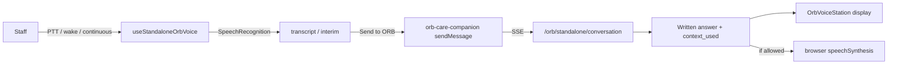

# ORB Voice Premium Upgrade — Audit

## Scope

Incremental upgrade of standalone ORB Voice (browser STT/TTS primary, optional realtime and future premium TTS). No rebuild of capture, recognition, wake phrase, or ORB streaming.

## Current working flow

| Stage | Primary module | Notes |
|-------|----------------|-------|
| Settings persistence | `use-standalone-orb-voice.ts` → `localStorage` `orb-voice-settings` | Legacy key migrated |
| Mic / PTT / wake | `orb-voice-capture.ts`, `orb-speech-recognition-start.ts` | User-gesture start required |
| Browser TTS | `use-standalone-orb-voice.ts` `runSpeech` | Profile via `resolveBrowserVoice` |
| Realtime (optional) | `orb-realtime-voice-client.ts`, `/orb/voice/session` | Falls back to browser |
| Reply display | `orb-voice-station.tsx` | `assistantReply` from chat |
| Auto-speak | `orb-care-companion.tsx` | `resolveOrbVoiceSpeechDecision` + shorter summary |
| High-risk pause | `indicare-intelligence-core.ts` | `shouldPauseVoiceAutoSend` on send |
| Privacy block | `orb-voice-speech-policy.ts` | privacy / low sensory / depth |

## What must not be broken

- Push-to-talk and continuous conversation in `useStandaloneOrbVoice`
- Browser `SpeechRecognition` and `speechSynthesis` fallback
- Wake phrase handling (`WAKE_PHRASE_TEXT`, strip wake from transcript)
- ORB text reply on voice screen (`data-orb-voice-reply`)
- `shouldPauseVoiceAutoSend` for `residential_deep` / `safeguarding_critical`
- No ElevenLabs or API keys in frontend bundles
- Standalone boundary (no auto-save to live child records)

## Transcript capture

- **Browser PTT:** `transcript` + `interimTranscript` in hook; shown under **You said** in station.
- **Realtime:** `turns[]` in station; compact **Recent voice turns** list.
- **Storage:** User-initiated save via `saveVoiceTranscript`; respects `saveTranscript` setting; provider `transcript_storage` enforced on server for premium paths.

## ORB reply display

- Written answer = full streamed/chat content (source of truth).
- Station shows **ORB replied** with speech status (speaking / paused / silent).
- Spoken output uses `buildOrbSpokenSummary` when auto-speak is allowed.

## Speech trigger / block

| Condition | Auto-speak |
|-----------|------------|
| `voiceReplies` off | Blocked |
| `privacyMode` / `lowSensoryMode` | Blocked (manual Speak again when safe) |
| `safeguarding_critical` | Blocked |
| `residential_deep` | Text-first; manual short summary only |
| High-risk topic terms | Blocked unless sensitive spoken + provider allow |
| Premium TTS | Server `/orb/voice/speak` only if provider + env allow |

## Settings storage

- Client: `ORB_VOICE_SETTINGS_STORAGE_KEY` in `orb-voice-types.ts`
- New fields: `privacyMode`, `sensitiveSpokenReplies`, curated `voicePresetId`
- Provider: `premium_tts_enabled`, `transcript_storage` via `provider_data_intelligence_settings_service` (server)

## Premium TTS insertion point

- Backend: `services/orb_voice_provider_service.py` → `POST /orb/voice/speak`
- Frontend: `lib/orb/voice/orb-voice-provider.ts` (status + speak request only)
- Default remains `browser_speech`; `text_only` for safeguarding/privacy

## Current limitations

- ElevenLabs hook returns no `audio_url` until wired server-side
- Voice timbre varies by OS/browser
- Provider AI settings UI is admin-only; voice uses server enforcement on speak
- Realtime and browser UX still differ slightly

## Files touched in upgrade

See `docs/orb-voice-premium-upgrade.md`.
