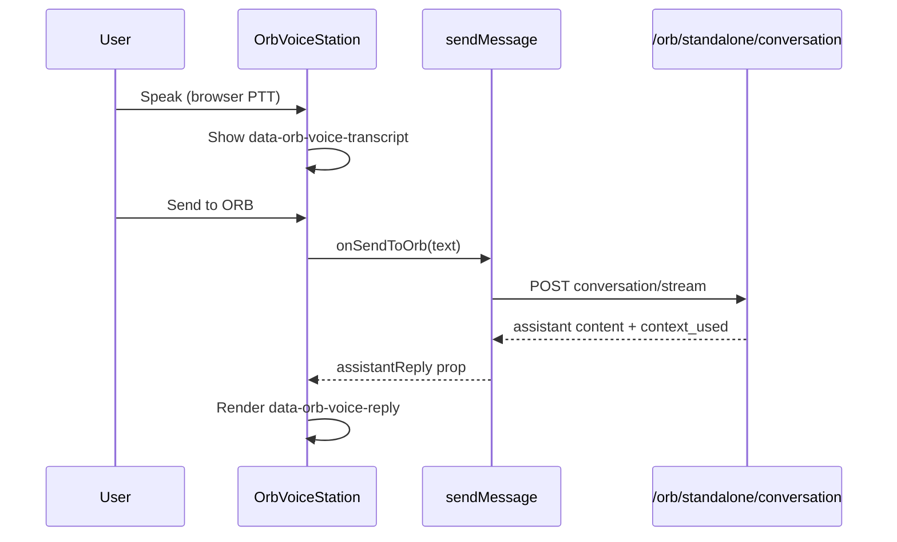

# ORB Voice — Transcript & Reply Visibility Audit

## Symptom

Staff using ORB Voice (especially browser push-to-talk fallback) could speak or capture a transcript, send to ORB, and hear or wait for a response — but **ORB’s text reply did not appear on the Voice screen**.

## Root cause

1. **`OrbVoiceStation` received `assistantReply` from `OrbCareCompanion` but never rendered it in JSX.**  
   The prop was only referenced when saving voice transcripts (`voiceSummary: assistantReply`), not for on-screen display.

2. **Dual reply paths were disconnected:**
   - **OpenAI Realtime WebRTC:** Reply text accumulated in local `turns` state via `onAssistantDelta` / `onAssistantDone` — **worked** when session active.
   - **Browser PTT (`useBrowserLaunch`):** User transcript shown from `voice.transcript`; send went through `onSendToOrb` → `sendMessage` → chat API. Reply landed in **chat message history** (`voiceStationAssistant` memo) and was passed back as `assistantReply` — **but UI ignored it**.

3. **No pending/reply skeleton** during `pending` chat send from voice panel.

## Fix (implemented)

| Area | Change |
|------|--------|
| `orb-voice-station.tsx` | Compute `displayedOrbReply` from `assistantReply` prop OR assistant turns |
| | Render `data-orb-voice-reply` panel with ORB text |
| | Show `data-orb-voice-spoken-blocked` when spoken reply blocked but text shown |
| | `data-orb-voice-reply-pending` while chat pending |
| | `data-orb-voice-continue-chat` / Continue in chat action |
| `orb-care-companion.tsx` | Unchanged wiring — `voiceStationAssistant` already correct |

## Behaviour preserved

- Wake phrase, continuous conversation, browser speech recognition
- Dictate capture routing
- `shouldBlockAutoSpokenReply` / privacy / low-sensory / safeguarding-critical rules
- `shouldPauseVoiceAutoSend` for `residential_deep` / `safeguarding_critical`
- Realtime WebRTC transcript turns
- Spoken reply via TTS when allowed

## How visibility works now

## Tests

- `tests/test_orb_voice_transcript_reply_visibility.py`
- `frontend-next/components/orb-standalone/orb-premium-ux-polish.test.ts`

## Remaining limitations

- Realtime and browser paths still use slightly different transcript UX (turn list vs single transcript block).
- Very long replies scroll inside capped panel (`max-h-[min(36vh,18rem)]`).
- `assistantReply` tracks last completed assistant message in active chat — if user switches chat while voice open, reply source follows active chat (expected).
